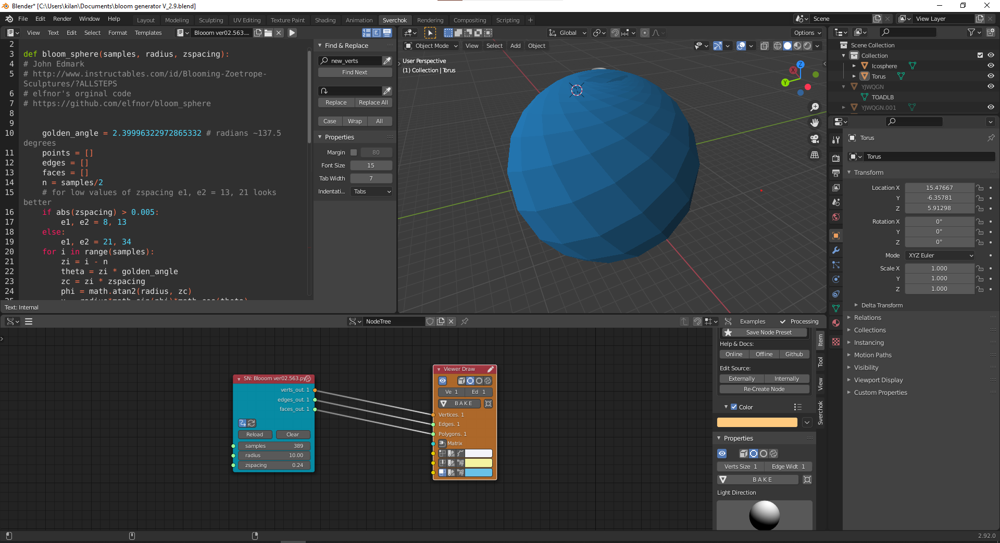

# bloom_sphere_updated_blender_2.8

I did [my project](http://fabacademy.org/2020/labs/techworks/students/faisal-alkilani/final%20project/00-Slide%20and%20video/) in fabacademy2020, but I did the work on the old Blender 2.79 becuase [elfnor's code](https://github.com/elfnor/bloom_sphere) did not work on the new one. However, I was not satisfied on my work until adjust his code to be compatible with the Sverchok on Blender 2.8+.

